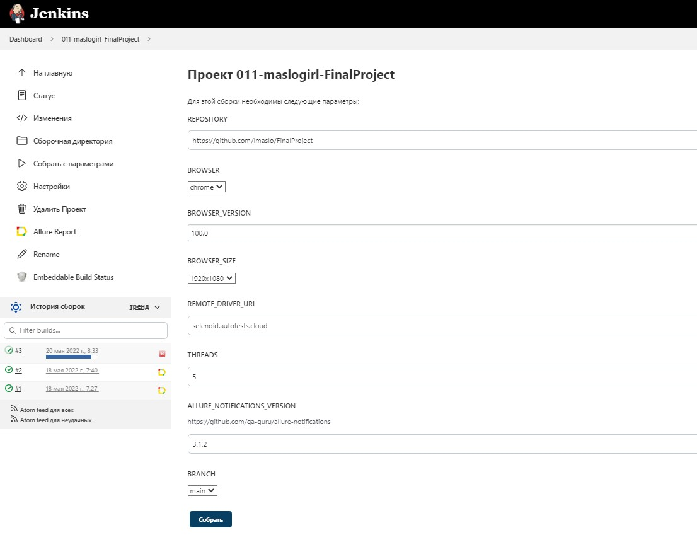
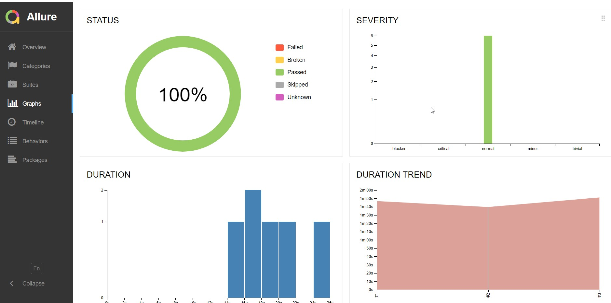
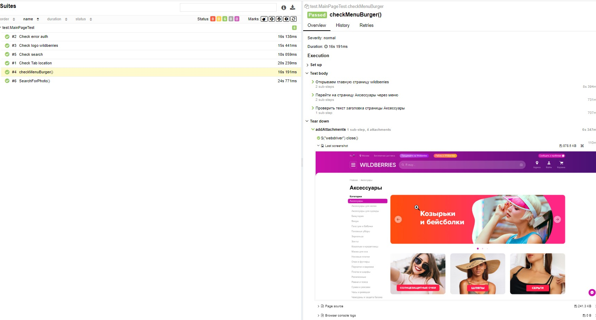
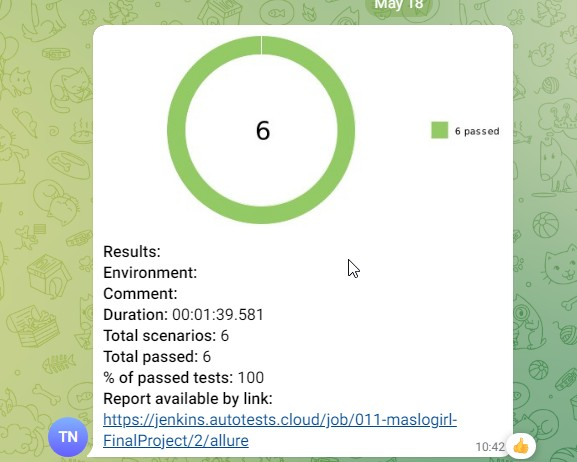

# Дипломный проект по автоматизации тестирования для wildberries. 
<a target="_blank" href="https://www.wildberries.ru//">Веб сайт wildberries</a>

## :memo: Содержание:

- [Реализованные проверки](#boom-Реализованные-проверки)
- [Технологии](#classical_building-Технологии)
- [Сборка в Jenkins](#man_cook-Jenkins-job)
- [Запуск из терминала](#electron-Запуск-тестов-из-терминала)
- [Allure отчет](#bar_chart-Allure-отчет)
- [Отчет в Telegram](#envelope-Уведомление-в-Telegram-при-помощи-бота)
- [Видео пример](#video_camera-Видео)

## :boom: Реализованные проверки

- ✓ Проверка логотипа
- ✓ Проверка функции поиска по тексту
- ✓ Проверка текста ошибки на странице авторизации/регистрации
- ✓ Проверка страницы Адреса
- ✓ Проверка функции поиска по фото
- ✓ Проверка поиска через меню (бургер)

## :classical_building: Технологии

<p align="center">


</p>

## :man_cook: Jenkins job
</a>  <a target="_blank" href="https://jenkins.autotests.cloud/job/011-maslogirl-FinalProject/">Jenkins job</a>
<p align="center">
<a href="https://jenkins.autotests.cloud/job/011-maslogirl-FinalProject/"></a>
</p>


###  Параметры сборки в Jenkins:

- REPOSITORY  (репозиторий для сборки)
- BROWSER (браузер, по умолчанию chrome)
- BROWSER_VERSION (версия браузера, по умолчанию 100.0)
- BROWSER_SIZE (размер окна браузера, по умолчанию 1920x1080)
- REMOTE_DRIVER_URL (логин, пароль и адрес удаленного сервера selenoid)
- THREADS (количество потоков для запуска тестов, по умолчанию 5)
- BRANCH (по умолчанию main)

## :electron: Запуск тестов из терминала

Локальный запуск:
```
gradle clean test
```

Удаленный запуск:
```
clean
test
-Dbrowser=${BROWSER}
-DbrowserVersion=${BROWSER_VERSION}
-DbrowserSize=${BROWSER_SIZE}
-DbrowserMobileView="${BROWSER_MOBILE}"
-DremoteDriverUrl=https://user1:1234@${REMOTE_DRIVER_URL}/wd/hub/
-DvideoStorage=https://${REMOTE_DRIVER_URL}/video/
-Dthreads=${THREADS}
```


## :bar_chart: Allure-отчет
</a> Отчет в <a target="_blank" href="https://jenkins.autotests.cloud/job/011-maslogirl-FinalProject/3/allure/#graph">Allure report</a>
<p align="center">
<a href="https://jenkins.autotests.cloud/job/011-maslogirl-FinalProject/3/allure/#graph"></a>
</p>
<p align="center">
<a href="https://jenkins.autotests.cloud/job/011-maslogirl-FinalProject/3/allure/#suites/f65ff973144ec53ed351dc6a47db7338/b8f9bddb75fae127/"></a>
</p>


## :envelope: Уведомление-в-Telegram-при-помощи-бота
<p align="center">
</a>
</p>


## :video_camera: Видео
<p align="center">
</a>
</p>
